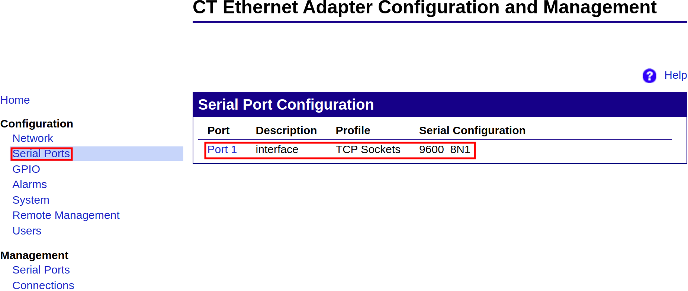

# ctlaser_driver

This package serves as an interface for operating Optris CTlaser pyrometers within the ROS environment.
Using the Digi RealPort CT Ethernet Adapter, we use a TCP Socket server/client to facilitate communication
with the serial interface.

### Communication Flow:

1. **Optris Pyrometer** ⟶ (Serial) ⟶ **CT Ethernet Adapter** ⟶ (TCP Socket Server/Client) ⟶ **Computer with ROS**

This document presents three steps to ensure a smooth configuration and utilization of the provided software:

## 1. Install the ctlaser_driver Software.

## 2. Set Basic Parameters.

This section provides insights into operating the `ctlaser_driver` according to your specific requirements.
Tune the settings to achieve optimal performance while reading the temperature of a given surface with Optris
CTlaser pyrometers.

In the `ctlaser_driver` package, go to the `launch` directory and open the `ctlaser_driver.launch`. Set the CT
Ethernet Adapter ip address and port (see Section 3 for more information). Optionally, set the desired temperature
output frequency experience in working with Optris CTlaser pyrometers within the ROS framework.

When the pyrometer turns on, the factory default emissivity and transmissivity are set. This parameters can be included
in the `.launch` file so it gets loaded on startup, or set via rosservices later.

### 2.1. Published Topics

- ```/ctlaser_driver/current_temperature``` ([sensor_msgs/Temperature](https://docs.ros.org/en/melodic/api/sensor_msgs/html/msg/Temperature.html))

### 2.2. Services

- ```/ctlaser_driver/lights_switch``` ([std_servs/SetBool](https://docs.ros.org/en/noetic/api/std_srvs/html/srv/SetBool.html))
- ```/ctlaser_driver/set_emissivity``` (ctlaser_driver/set_float)
- ```/ctlaser_driver/set_transmissivity``` (ctlaser_driver/set_float)

### 2.3. Parameters

- ```laser_ip (string)``` : The CT Ethernet Adapter ip address.
- ```laser_port (int)``` : The port configured in the adapter (see Section 3).
- ```target_lights (bool)``` : The initial lights state.
- ```frequency (double)``` : The temperature output frequency (hz)
- ```emissivity (double)``` : The initial emissivity (0.0 < e < 1.0)
- ```transmissivity (double)``` : The initial transmissivity (0.0 < e < 1.0)

## 3. Configure the TCP Server on the CT Ethernet Adapter.

Plug the ethernet cable to CT Ethernet Adapter and make sure both the adapter and you computer are in the same network.
The DHCP server will most likelly assign an ip address to your device. In case it doesn't, press the adapter reset button
while it turned off, then turn it on. Keep the button pressed until the network lights blink in a pattern 1-5-1. The device
will be reset to factory configurations and the DHCP server will be able to assign a new ip address to you adapter.

- Provided that after these steps the adapter's ip address is known (suppose 146.164.53.228), go your browser and access the firmware webpage
```http://146.164.53.228/login.htm``` as in the figure directly bellow.


- Login with the default ```user name: root``` and ```password: dbps```. Proceed to ```Serial Ports``` in Configurations, then click the according
port as in the figure bellow. A new tab with Port Profile Settings will be shown.



- After clicking on the desired port, the Serial Port Configuration - Interface will show up. Click on the Port Profile Settings tab, then
Change Profile. You will be prompted to choose one option on the Select Port Profile tab. Choose TCP Sockets as in the figure bellow.


- After choosing TCP Sockets you will be prompted to enable the desired TCP ports. The communication between the ctlaser_driver and the device is made
using the Raw TCP port which defaults to port ```port: 2101```. As in the figure bellow, enable at least the Raw TCP and Telnet so it gets easier to check
for communication problems using Telnet.


- Another fundamental step is to configure the serial port settings in order for the adapter to be able to communicate with the serial port. In order to do so,
still on the Serial Port Configurations - Interface tab, right bellow the Port Profile Settings you will find Basic Serial Settings. As in the figure bellow,
set the baud rate to the same one configured on the device. The other properties can be found in pyrometer's the manual.


